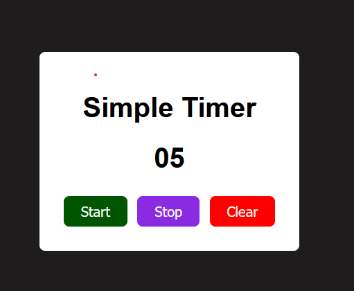

# 🔢 Simple Counter Web App

This is a simple and interactive **Counter App** created using **HTML**, **CSS**, and **Vanilla JavaScript**. It allows users to increment, decrement, and reset a counter dynamically — a great practice for DOM manipulation and event handling.

🌐 **Live Site:** [simple-counter-khadizacoder.netlify.app](https://simple-counter-khadizacoder.netlify.app/)

---

## 📸 Screenshot

> Here's how it looks in action:



---

## ✨ Features

- ➕ Increase counter by 1
- ➖ Decrease counter by 1
- 🔁 Reset to 0
- 💻 Simple and clean UI
- 📱 Fully responsive for mobile & desktop

---

## 🧰 Technologies Used

| Tech         | Purpose                       |
|--------------|-------------------------------|
| HTML5        | Structure of the counter app  |
| CSS3         | Styling and layout            |
| JavaScript   | Event handling, counter logic |

---

## 🔧 Clone This Project

Want to try it yourself?

```bash
git clone https://github.com/khadizacoder/simple-counter.git

